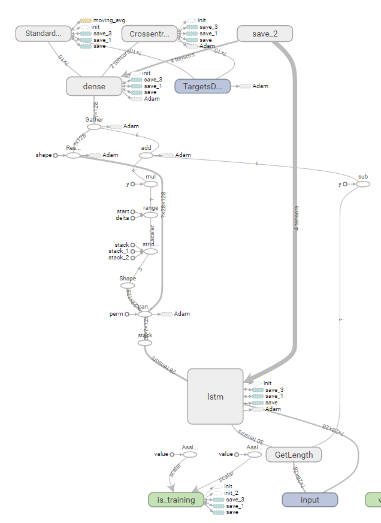
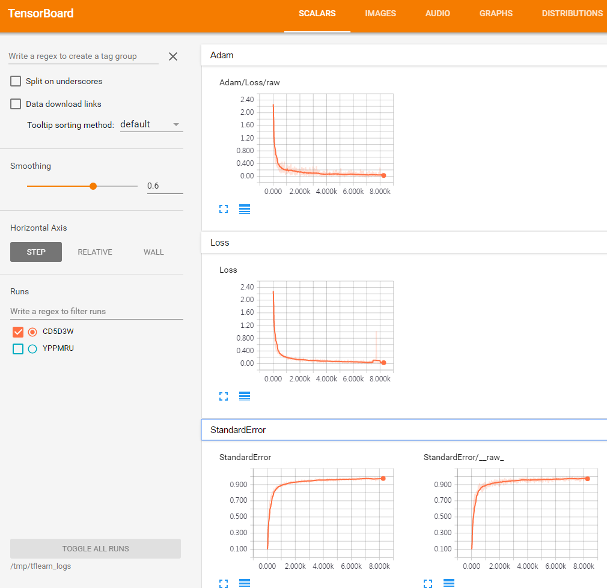

# Implemention LSTM example for MNIST data with tflearn

### [Tflearn](https://github.com/tflearn/tflearn) is higher-level API for TensorFlow.
### Dependencies: tensorflow 1.0, tflearn (sudo pip install tensorflow, tensorflow-gpu(GPU only), tflearn)
#### Input: 28 rows of 28x1 fixel vector
#### Output: 10 classes
### Usage
#### Training: python mnist_lstm.py
#### Tensorboard: tensorboard --logdir=/tmp/tflearn_logs/

...shell
$ python mnist_lstm.py

...
Training Step: 8600  | total loss: 0.03430 | time: 23.780s
| Adam | epoch: 010 | loss: 0.03430 - R2: 0.9763 -- iter: 55000/55000
training time: 131.180480003
predict time: 2.66158895493
accuracy:  97.53
'''

